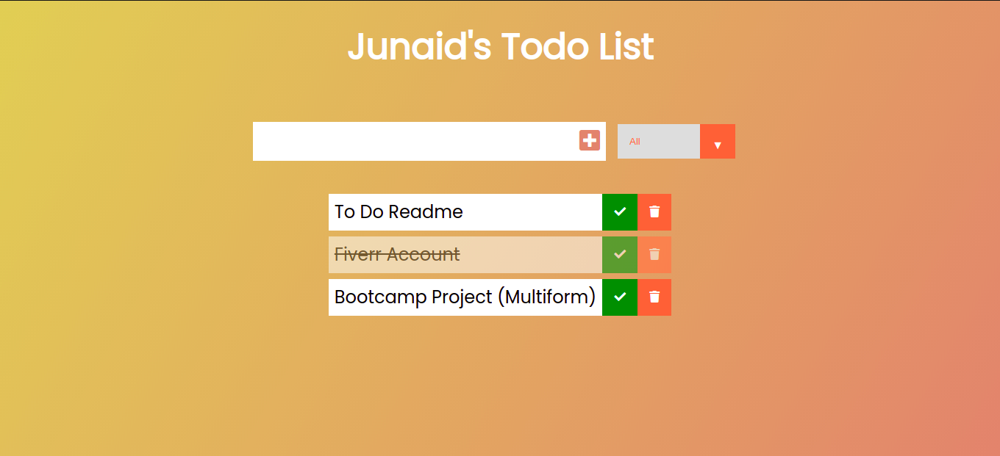

# :closed_book: Todo List

### _Todo List Applciation, where Users can add, remove, complete and filter tasks !_

### Link :link: https://the-todolist.netlify.app/

## Interface

## Run Locally

- Run this command `git clone https://github.com/developer-junaid/Todo-List.git`
- You are now in the dev environment and you can play around

## Features

- Create Tasks
- Delete Tasks
- Complete Tasks
- Filter Tasks
- Save Tasks
- Open Source (Tweak it and use it) :)

## Tech Stack

- HTML5
- CSS3
- Javascript
